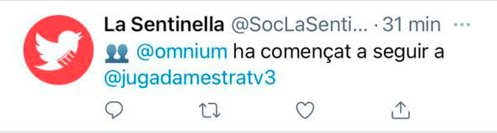

# SocLaSentinella
[@SocLaSentinella](https://twitter.com/SocLaSentinella) és un bot de Twitter (inspirat en [@GobiernoAlerta](https://twitter.com/GobiernoAlerta)) que publica els moviments (follows, unfollows i canvis de biografia) de diversos actors polítics i dels comptes institucionals de Catalunya.

## FAQS
#### Cada quant es refresquen les dades?
Aproximadament cada 2 hores. Per el millor seguiment però, aquestes només és publicaran de 8 a 23h.
#### D'on surten les dades?
Les dades provenen de l'API de Twitter. Tota la informació és pública i públicament accessible. Pots comprovar la veracitat des de doesfollow.com
#### És possible que hi hagi falsos positius?
Si, un compte de Twitter pot haver bloquejat a una altre que el sistema monitora. En aquest cas, el bot mostrarà que el compte monitorat ha deixat de seguir a l'anterior. No es pot comprovar externament si un compte té bloquejat a un altre.

## Comptes en observació:
*Els comptes en observació poden variar segons l'actualitat política i estaran sempre reflexats en aquest repositori.*
- @govern
- @parlamentcat
- @mossos
- @bomberscat
- @exteriorscat
- @vicepresicat
- @aferssocialscat
- @justiciacat
- @territoricat
- @tic
- @treballcat
- @rodalies
- @FGC
- @112
- @interiorcat
- @icscat
- @universitatscat
- @salutcat
- @llenguacatalana
- @joventutcat
- @transit
- @meteocat
- @emergenciescat
- @cultura_cat
- @educaciocat
- @gencat
- @CatalunyaRadio
- @tv3cat
- @agenciaacn
- @lagrossacat
- @empresacat
- @eapccat
- @diba
- @bcn_ajuntament
- @DiputacioGirona
- @girona_cat
- @DiputacioLleida
- @paerialleida
- @Dipta_cat
- @TGNAjuntament
- @omnium
- @Societatcc
- @perearagones
- @LauraVilagra
- @wagensberg
- @rogertorrent
- @ernestmaragall
- @PauVilassar
- @JnnDiaz
- @anna_caula
- @MeritxellSerret
- @LauraBorras
- @KRLS
- @JACS_JaumeACS
- @jcanadellb
- @elsa_artadi
- @ramontremosa
- @albertbatet
- @mariadolorsa
- @carlesral
- @aramateix
- @pjuvilla
- @salvadorilla
- @Eva_Granados
- @FerranPedret
- @Ramon_Espadaler
- @DGChanca
- @jessicaalbiach
- @carrizosacarlos
- @annagrauarias
- @Nmartinblanco
- @alejandroTGN
- @Lroldansu
- @Igarrigavaz
- @MariaEGarciaFu2
- AntonioGalleg0
- JGarrigaDomenec
- @AlbertoTPaneque
- @jcuixart
- @jordisanchezp
- @junqueras
- @quimforn
- @dolorsbassac
- @raulromeva
- @jorditurull
- @joseprull
- @ForcadellCarme
- @ClaraPonsati
- @AnnaGaSabate
- @martarovira
- @toni_comin
- @valtonyc
- @RaholaOficial
- @lluis_llach
- @AlbanoDante76
- @antoniobanos_
- @yeyaboya
- @fsancos
- @PresidenciaDdgi
- @nuriamarinlh
- @AdaColau
- @LoJoan
- @nllaurado

## Sobre el codi:
*El codi està en procés de proves temporal. En quant aquest estigui en una versió final quedarà publicat en aquest repositori.*
